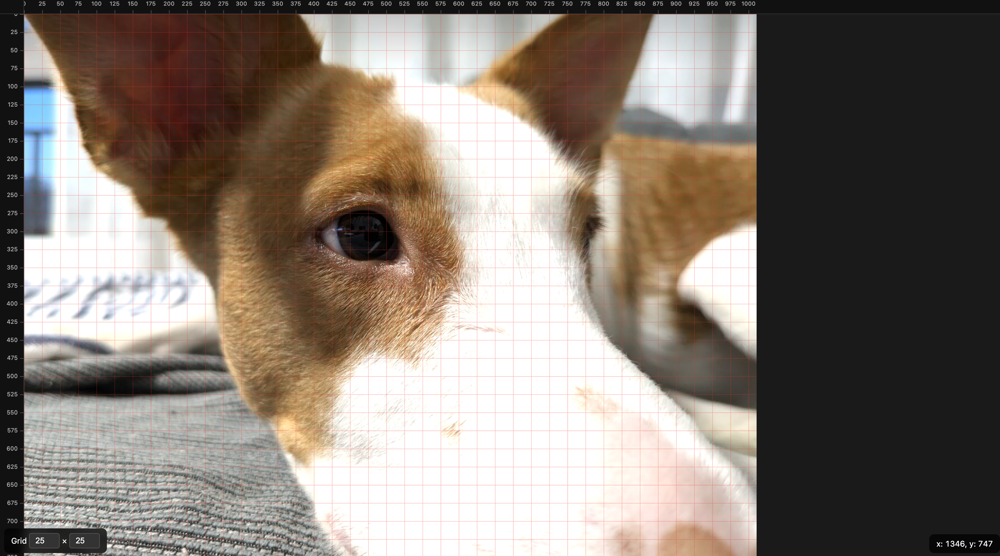

# ImageGridView 🖼️🔲

Drop an image and overlay a configurable pixel grid on top of it. Useful for pixel art, sprite sheets, tilesets, and any task where you need to inspect images at exact pixel coordinates.

## ✨ Features

- 📂 Drag & drop any image
- 🔲 Configurable grid size (default 25×25)
- 📐 Real-time pointer coordinates (origin at top-left)
- 🖼️ Image displayed at 100% scale
- 📎 Copy the specific coordinate to your clipboard on click



## 🚀 Getting started

```bash
npm install
npm run dev
```

Open `http://localhost:5173` and drop an image onto the page.

## 📦 Available scripts

| Command             | Description                  |
|---------------------|------------------------------|
| `npm run dev`       | Start dev server             |
| `npm run build`     | Type-check & build for prod  |
| `npm run preview`   | Preview production build     |
| `npm run lint`      | Lint TypeScript sources      |
| `npm run format`    | Format code with Prettier    |

## 🛠️ Tech stack

- TypeScript
- Vite
- Canvas API
- ESLint + Prettier

## 📄 License

```
Copyright 2026 Pedro Vicente Gómez Sánchez

Licensed under the Apache License, Version 2.0 (the "License");
you may not use this file except in compliance with the License.
You may obtain a copy of the License at

    http://www.apache.org/licenses/LICENSE-2.0

Unless required by applicable law or agreed to in writing, software
distributed under the License is distributed on an "AS IS" BASIS,
WITHOUT WARRANTIES OR CONDITIONS OF ANY KIND, either express or implied.
See the License for the specific language governing permissions and
limitations under the License.
```

## Developed By
------------

* Pedro Vicente Gómez Sánchez - <pedrovicente.gomez@gmail.com>

<a href="https://x.com/pedro_g_s">
  
</a>
<a href="https://es.linkedin.com/in/pedrovgs">
  
</a>
